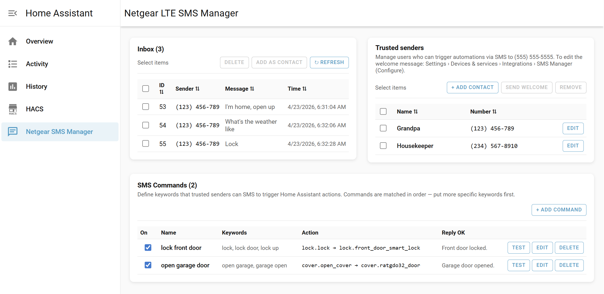
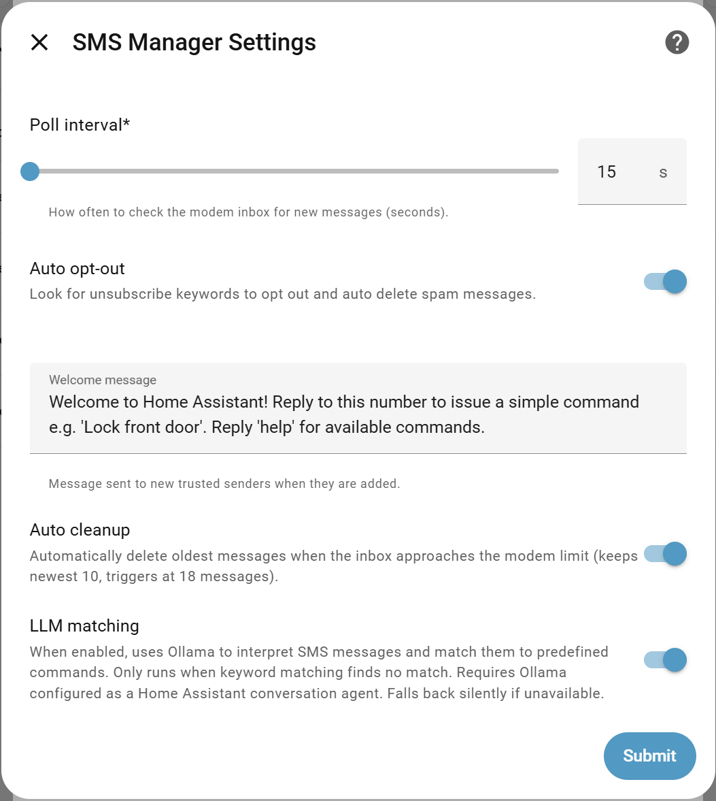
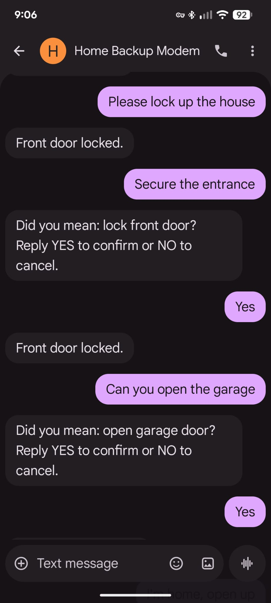
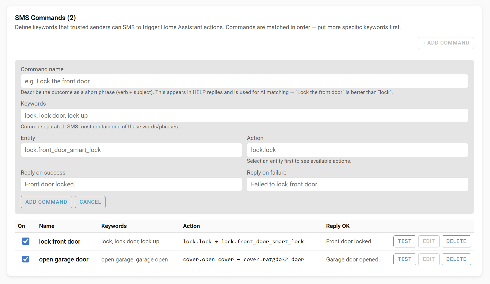
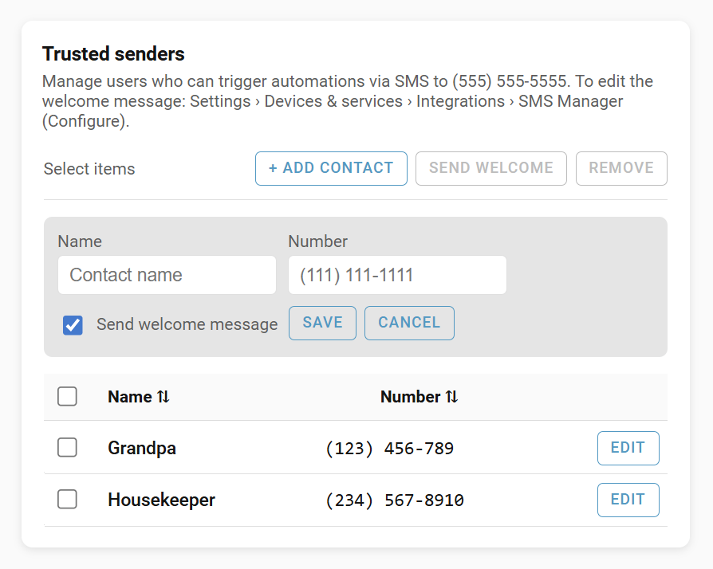

# Netgear LTE SMS Manager

[](https://github.com/hacs/integration)
[](https://opensource.org/licenses/MIT)

A Home Assistant custom component that extends the core `netgear_lte` integration with SMS inbox management and SMS-triggered home automation commands.

## Screenshots



*Main panel — inbox, trusted senders, and SMS commands at a glance*

## Overview

The core `netgear_lte` integration can send SMS but cannot read or manage the inbox. Netgear LTE modems hold around 20 messages — once full, new messages stop arriving. This component solves that with automatic inbox management, and builds on it to let trusted contacts control your home by SMS.

## Features

- **Sidebar panel** — full inbox UI with message view, delete, contacts, and command management
- **Auto inbox cleanup** — automatically trims the inbox when it approaches the modem limit (triggers at 18 messages, keeps the newest 10); untrusted messages deleted first
- **Real-time polling** — checks for new messages every 15 seconds (configurable)
- **SMS commands** — trusted contacts can trigger HA service calls by SMS (lock doors, open garage, etc.)
- **Keyword matching** — define keywords that map to commands; execute immediately on match
- **LLM matching** — optional Ollama-backed fuzzy matching for natural language messages; requires confirmation before executing
- **HELP autoresponder** — trusted contacts SMS "help" to get a list of available commands
- **Per-command enable/disable** — toggle individual commands without deleting them
- **Trusted contacts** — only whitelisted senders can trigger commands
- **Welcome message** — auto-send a greeting when a new contact is added
- **Auto opt-out** — detects marketing messages containing opt-out instructions and replies STOP
- **Services API** — all functions exposed as HA services for use in automations

## Prerequisites

- Home Assistant 2025.1.0 or newer
- [netgear_lte](https://www.home-assistant.io/integrations/netgear_lte) core integration configured and working

## Installation

This integration is not in the HACS default store. Add it as a custom repository:

1. In HACS, click ⋮ → **Custom Repositories**
2. Add `murraybiscuit/hacs_netgear_lte_sms_manager` with type **Integration**
3. Install **Netgear LTE SMS Manager** from HACS
4. Restart Home Assistant
5. Go to **Settings → Integrations → Add Integration** and search for **Netgear LTE SMS Manager**

### Manual Installation

Copy `custom_components/netgear_lte_sms_manager/` into your `config/custom_components/` directory and restart Home Assistant.

## Configuration


After adding the integration, open the sidebar panel **Netgear SMS Manager** or go to **Settings → Integrations → Netgear LTE SMS Manager → Configure** to adjust:

| Option | Default | Description |
|---|---|---|
| Poll interval | 15s | How often to check the inbox |
| Auto cleanup | On | Trim inbox automatically when near capacity |
| Auto opt-out | On | Reply STOP to marketing messages |
| Welcome message | (set) | SMS sent to new contacts when added |
| LLM matching | Off | Ollama-based fuzzy command matching |

## SMS Commands

Commands let trusted contacts control Home Assistant by sending an SMS to your modem's SIM number.

### How it works

1. A trusted contact sends an SMS (e.g. "lock up")
2. The integration matches the message against your commands by keyword
3. The corresponding HA service is called (e.g. `lock.lock`)
4. A confirmation SMS is sent back to the sender

### Keyword matching

Each command has a list of trigger keywords. Any message from a trusted contact that contains one of those keywords (word boundary match) executes the command immediately.

Example command:
- **Name**: lock front door
- **Keywords**: lock, lock door, lock up
- **Service**: `lock.lock`
- **Entity**: `lock.front_door`
- **Success reply**: Front door locked.

### LLM matching (optional)

When keyword matching finds no match, LLM matching (if enabled) sends the message to your Ollama instance for interpretation. Because LLM responses can be imprecise, a confirmation round-trip is required before any action is taken:

1. Message arrives: *"Can you secure the front door?"*
2. Component asks: *"Did you mean: lock front door? Reply YES to confirm or NO to cancel."*
3. Sender replies YES → command executes
4. Pending confirmation expires after 5 minutes if no reply

Requires Ollama configured as a Home Assistant conversation agent. Auto-detects the Ollama URL and model from the HA config entry.



#### Why Ollama directly, not the HA voice assistant?

HA's `conversation.async_converse` API routes all text through the home control pipeline, which wraps the LLM in a system prompt about device control and enables tool calls for executing HA services. Sending a classification prompt like *"which command matches this message?"* through that pipeline causes the LLM to interpret it as a home control request and attempt to execute intents — not classify text.

This component calls the Ollama `/api/generate` endpoint directly, bypassing the home control context entirely. The LLM receives only the classification prompt and returns a plain text response. This is intentional and necessary for correct behaviour.

### HELP autoresponder

Any trusted contact can SMS **help** to get a list of enabled commands and their keywords.

### Managing commands



Commands are managed through the sidebar panel UI or via HA services (`add_command`, `update_command`, `remove_command`). Each command requires:

- **Name** — a clear intent label (used in HELP replies and LLM prompts, e.g. "lock front door")
- **Keywords** — one or more trigger phrases
- **Service** — HA service to call (e.g. `lock.lock`)
- **Entity ID** — entity to act on
- **Success/failure replies** — optional SMS sent back to the sender

## Trusted Contacts



Only contacts in the trusted list can trigger commands. Manage them via the panel or services.

When a contact is added with "Send welcome" enabled, the configured welcome message is sent to their number automatically.

## Services

All services accept an optional `host` parameter (modem IP). If omitted and only one modem is configured, it is auto-detected.

| Service | Description |
|---|---|
| `list_inbox` | List all messages in the modem inbox |
| `delete_sms` | Delete one or more messages by ID |
| `cleanup_inbox` | Policy-based cleanup (retain count, age, whitelist) |
| `get_inbox_json` | Get inbox as JSON (for template sensors) |
| `add_contact` | Add a trusted contact |
| `update_contact` | Update a contact's name or number |
| `remove_contact` | Remove a contact by UUID |
| `send_welcome` | Send the welcome message to a number |
| `add_command` | Add an SMS command |
| `update_command` | Update an existing command |
| `remove_command` | Remove a command by UUID |
| `test_command` | Test command dispatch with a synthetic message |

### `test_command`

Useful for testing without waiting for a real SMS. Bypasses the modem entirely.

```yaml
service: netgear_lte_sms_manager.test_command
data:
  sender: "14255550123"   # must be a trusted contact
  message: "lock up"
  send_reply: false        # set true to also send the reply SMS
```

## Events

| Event | Fired when |
|---|---|
| `netgear_lte_sms_manager_new_sms` | A new message arrives from any sender |
| `netgear_lte_sms_manager_command_executed` | An SMS command is matched and executed |
| `netgear_lte_sms_manager_auto_opt_out` | A marketing message is detected and STOP is sent |
| `netgear_lte_sms_manager_cleanup_complete` | `cleanup_inbox` service finishes |

## Automation Example

```yaml
automation:
  - alias: "Notify on new SMS from unknown sender"
    trigger:
      platform: event
      event_type: netgear_lte_sms_manager_new_sms
    action:
      service: notify.mobile_app
      data:
        message: "SMS from {{ trigger.event.data.sender }}: {{ trigger.event.data.message }}"
```

## Troubleshooting

**No netgear_lte entries configured** — set up the core `netgear_lte` integration first.

**Commands not triggering** — check that the sender's number is in Trusted Contacts (digits only, e.g. `14255550123` not `(425) 555-0123`).

**LLM matching not working** — requires Ollama configured as a HA conversation agent. Check that the Ollama container is running and the model is loaded.

**Panel not loading after update** — the panel JS URL is cache-busted by content hash on each reload. If it still shows stale content, do a hard refresh in the browser.

## License

MIT — see LICENSE file for details.

## Credits

- [eternalegypt](https://github.com/eternalegypt/eternalegypt) — Netgear modem API wrapper
- [netgear_lte](https://www.home-assistant.io/integrations/netgear_lte) — core HA integration
